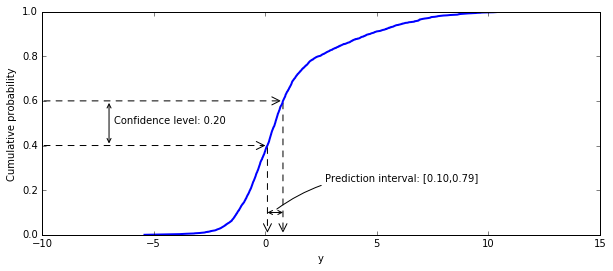

# KRRPM (Repository under construction)
## Kernel Ridge Regression Predictive Machine

This repository contains an implementation of a Kernel Ridge Regression
Predictive Machine, a non-parametric method for the probabilistic prediction of
continuous values

## KRRPM   
KRRPM[1] is a form of Conformal Predictive Distribution[2] which is a framework for
non-parametric prior-free probabilistic prediction.
The prediction for a test object is provided in the form of Cumulative
Distribution Function for the label of test objects.

A key advantage is that, under minimal assumptions, the KRRPM produces
**calibrated** predictions, i.e. it assigns probabilities to events that
correspond to the relative frequencies to those events, within statistical
fluctuation. The only assumption is that training data and test data be
*i.i.d.*, that is, independent and identically distributed.
  
 A gentle introduction to Conformal Predictive Distributions can be found in the 
 Tutorial at [https://cml.rhul.ac.uk/people/ptocca/HomePage/COPA2020___Tutorial_on_Predictive_Distributions.pdf]

## KRRPM Implementation  
The KRRPM.py file implements the Kernel Ridge Regression Predictive Machine.
The API it exposes has been kept as similar as possible to that of
`scikit-learn` regressors. This makes it interoperable with the `scikit-learn`
framework, allowing in particular the use of its parameter optimization
 facilities (e.g. `GridSearchCV`).

An instance of the KRRPM regressor is first created with the constructor
`KRRPM()`, which takes a scalar `a` as regularization parameter and a choice of
`kernel`.     The regression can be then `fit()` on the training data.     The
predictions are obtained with the `predict()` method; in keeping with the
`scikit-learn` conventions, the `predict()` method returns a vector with one
scalar (as opposed to a distribution) for each supplied test object. The value
corresponds to the median in the distribution computed for the test object. The
predictive distributions are in a data attribute (`predicted_distributions`) of
the regressor, which is populated when the predict() method is called. Each
predictive distribution (which corresponds in a sense to a Cumulative  Distribution Function, as mentioned
above) is expressed as a step-wise function specified by an array of 'n' floats.
The steps have all "height" `1/n` and the elements of the array specify their
location.

The implementation uses *O(n^2)* memory and *O(n^3)* time.

Some effort has been put into minimizing the use of memory. 
As a reference, a training set of 80,000 objects was used successfully to train 
a KRRPM model on a server with 132GB of RAM.

## Acknowledgements
This implementation was developed while at the Centre for Reliable Machine Learning, Royal Holloway, University of London.
The author is grateful to AstraZeneca for the grant R10911 "Automated Chemical Synthesis".

[1]: "Conformal Predictive Distributions  with Kernels", V. Vovk et al., 2018 [https://link.springer.com/chapter/10.1007/978-3-319-99492-5_4]
[2]: "Nonparametric Predictive Distributions Based on Conformal Prediction", V. Vovk, 2019, [https://doi.org/10.1007/s10994-018-5755-8]